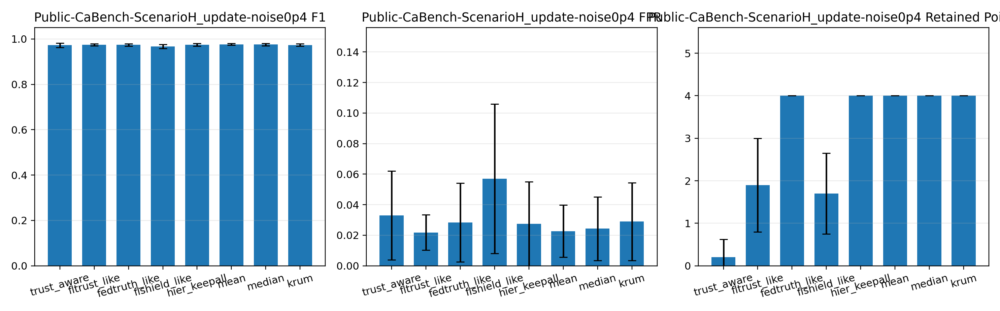
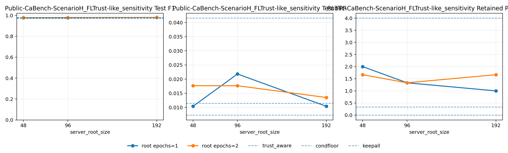
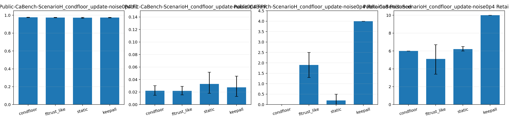
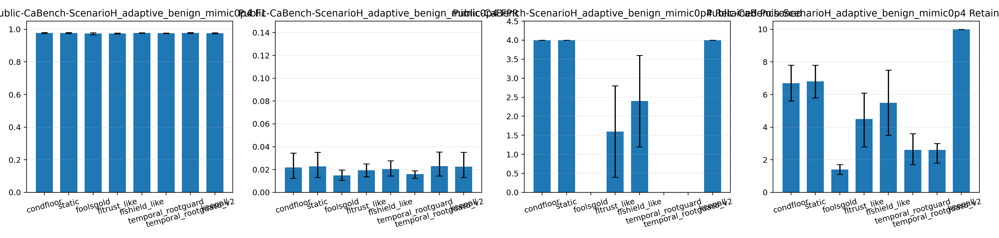
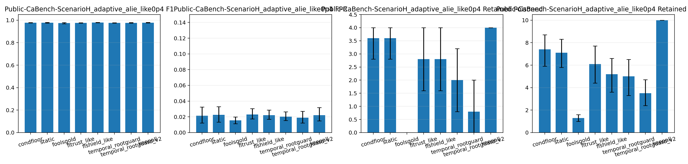

# HiTrust-FedBot: Trust-Aware Hierarchical Federated Web Bot Detection with Group-Coverage-Constrained Filtering

Author identities, affiliations, and correspondence details are intentionally separated into the submission title page. See `docs/EAAI_TITLE_PAGE_TEMPLATE_20260327.md`.

This draft consolidates the current strongest manuscript framing as of `2026-03-31` and is intended as the editable base for journal-template formatting.

## Abstract

Federated web bot detection in congested edge environments must cope with topology heterogeneity, limited communication budgets, and malicious client participation. In this setting, purely trust-based filtering is not enough: a strict filter may suppress poisoned updates, but it may also erase the only surviving representatives of a semantic client group. We present HiTrust-FedBot, a trust-aware hierarchical federated detection framework that combines grouped aggregation with a group-coverage-constrained trust filter. The framework is instantiated with a GraphSAGE backbone and evaluated on topology-aware pilot scenarios together with same-task public Ca-Bench validation on `scenario_e` and `scenario_h`, task-adapted FLTrust-like and FLShield-like baselines, an official FoolsGold comparator [17], paired multi-seed public comparisons with bootstrap confidence intervals and paired sign-flip tests, and an auxiliary public NSL-KDD validation. The evidence supports a conservative claim. On the same-task public hardest non-adaptive setting, `scenario_h + update_noise@0.4`, the targeted conditional-floor hardening reaches `F1=0.9798`, `FPR=0.0114`, and `0.0` retained poisoned clients; paired 10-seed analysis shows significant retained-poison reductions versus FLTrust-like and keep-all, while F1 and FPR differences are not significant. On the adaptive public suite, we now evaluate two camouflage geometries, `adaptive_benign_mimic` and `adaptive_alie_like`. On `scenario_h + adaptive_benign_mimic@0.4`, `temporal_rootguard` reaches `F1=0.9760`, `FPR=0.0159`, and `0.0` retained poisoned clients with `2.6` kept clients on average, while official FoolsGold also reaches `0.0` retained poisoned clients but keeps only `1.4` clients on average. Reusing the same `temporal_rootguard` configuration on external `scenario_e + adaptive_benign_mimic@0.4` yields `F1=0.9888`, `FPR=0.0182`, and `2.8` retained poisoned clients, whereas FoolsGold drops to `F1=0.9789` with `1.4` kept clients. These results position HiTrust-FedBot and its hardening variants as interpretable engineering controls for specific poisoning regimes rather than universal Byzantine defenses.

**Keywords:** federated learning, bot detection, adversarial robustness, trust-aware aggregation, GraphSAGE, edge security

## 1. Introduction

Federated learning offers an appealing deployment model for web bot detection when raw traffic or graph data cannot be centralized due to privacy, bandwidth, or governance constraints [1,2]. However, realistic federated cyber-security systems must withstand three pressures at once: non-IID client populations, communication limits, and adversarial client behavior. These pressures are especially severe for graph-based bot detection, where structural heterogeneity is part of the detection signal rather than nuisance variation to be averaged away.

Conventional robust federated aggregation focuses on suppressing malicious or low-quality updates [6-9]. That objective is necessary but incomplete in topology-aware security settings. When client populations are semantically partitioned, aggressive filtering may remove not only poisoned updates but also the only remaining representatives of a particular group. The resulting global model may be better filtered while becoming less representative of the underlying deployment population. This creates a tension between poisoning resistance and semantic coverage.

HiTrust-FedBot addresses that tension with a trust-aware hierarchical federated framework for web bot detection. Client updates are scored by trust, aggregated within semantic groups, and then combined hierarchically into a global update. A group-coverage-constrained filter prevents the federation from silently discarding an entire group. The current evidence shows that this design is useful, but in a narrower and more defensible way than an accuracy-dominance narrative. After adding same-task public Ca-Bench validation, task-adapted FLTrust-like and FLShield-like comparators, an official FoolsGold anchor, paired bootstrap and sign-flip analysis on the key public sweeps, and targeted hardening lines for both non-adaptive and two adaptive failure geometries, the strongest claim is that the framework controls retained poisoned participation more tightly on the hardest topology-aware settings without claiming universal adaptive dominance.

The paper makes four contributions.

- It introduces a grouped trust-aware aggregation pipeline tailored to topology-aware federated bot detection, where semantic group coverage must be preserved alongside poisoning resistance.
- It evaluates the framework with a GraphSAGE backbone across internal pilot scenarios, same-task public Ca-Bench `scenario_e` and `scenario_h`, and an auxiliary public NSL-KDD path, together with keep-all, classical robust-aggregation, task-adapted FLTrust-like and FLShield-like baselines, and an official FoolsGold adaptive comparator [17].
- It shows that the main security differentiator is not universal F1 superiority. Instead, the strongest evidence is tighter control of retained poisoned clients, and the key public claims are supported with paired multi-seed bootstrap confidence intervals and paired sign-flip tests for F1, FPR, retained poisoned clients, and retained total clients.
- It identifies two boundary cases, namely static small-group floor failure and defense-aware adaptive camouflage, and studies `condfloor` and `temporal_rootguard` as targeted engineering hardenings without overstating them as universal defaults; the adaptive analysis is further broadened from `adaptive_benign_mimic` to a second `adaptive_alie_like` camouflage geometry.

## 2. Related Work

### 2.1 Federated cyber-security detection

Recent studies have applied federated learning to intrusion detection, malicious traffic classification, and related cyber-security monitoring tasks because these domains naturally involve distributed data ownership and privacy constraints [3-5]. A common finding in this literature is that federated deployment improves data locality but also amplifies statistical heterogeneity and non-IID effects [3,4]. Our setting is aligned with this line of work but focuses more specifically on graph-structured web bot detection in congested edge environments, where the challenge is not only client drift but also structural fragmentation across client partitions.

### 2.2 Robust federated learning under poisoning

A second body of work studies federated robustness under Byzantine, backdoor, and update-poisoning attacks, typically through robust aggregators, anomaly scoring, client selection, or trust-based defenses [6-9,17]. These methods are directly relevant because our threat model includes poisoned client updates. However, much of the robust federated learning literature is designed for flat client pools and does not explicitly account for semantic group coverage. In such settings, dropping all low-trust clients may be acceptable; in our setting, the same action may erase an entire group and distort the final detector. HiTrust-FedBot extends the trust-filtering perspective by coupling poisoning resistance with group-preservation constraints, while also comparing against task-adapted FLTrust-like and FLShield-like baselines together with an official FoolsGold comparator in the adaptive public suite.

### 2.3 Graph learning for security analytics

Graph neural networks have become increasingly important in cyber-security tasks such as intrusion detection, social-bot analysis, fraud analysis, and anomalous behavior discovery because relational structure often contains information that feature-only models miss [10-12]. In particular, neighborhood aggregation methods such as GraphSAGE are attractive in distributed settings because they balance expressive structural learning with manageable model complexity [12,13]. Our experiments confirm that this structural advantage matters in the harder topology-aware scenarios: GraphSAGE substantially outperforms FeatureMLP on `scenario_h`, while the smaller `scenario_g` saturates for both backbones and therefore should not be overinterpreted.

### 2.4 Communication-efficient adaptation in federated systems

Communication-efficient federated optimization and parameter-efficient adaptation have also received considerable attention, especially for large or frequently updated models [1,14-16]. This literature motivates our comparison among `head_only`, `adapter_ft`, and `full_ft` tuning modes. Rather than treating communication as a purely systems-level add-on, we evaluate it jointly with adversarial robustness. The practical result is important: the strongest or near-strongest settings in our study do not require the highest communication budget.

### 2.5 Position of this work

HiTrust-FedBot sits at the intersection of these lines of work. It is a federated cyber-security detector, a poisoning-aware trust-filtering defense, a graph-based structural learner, and a communication-conscious adaptation study. The main distinction from prior trust-based robust federated methods is the explicit treatment of semantic group coverage as a first-class constraint. This design choice changes both the aggregation rule and the interpretation of adverse edge cases, which we now analyze directly through same-task public validation, FLTrust-like baseline comparison, an official FoolsGold anchor, sensitivity analysis, and targeted hardening experiments.

## 3. Method

### 3.1 Problem setting

We consider a federated bot-detection system with a central server and multiple edge clients. Each client trains locally on a traffic-derived graph partition and uploads model updates rather than raw data. Let the clients be partitioned into semantic groups induced by topology or role-aware partition metadata. The server must aggregate client updates while resisting poisoned participants and preserving useful group-level information.

### 3.2 Threat model

We consider malicious clients that participate in training and poison the federated update stream. Two attack types are studied in the main non-adaptive experiments:

- `sign_flip@0.4`: 40% of clients invert or directionally corrupt their model updates.
- `update_noise@0.4`: 40% of clients inject strong perturbation noise into the update stream.

The attacker does not need to compromise all clients. The operational question is whether the global model can remain effective when a minority of clients are malicious and when some semantic groups are smaller, structurally fragile, or more weakly represented than others.

For the adaptive public analysis, we additionally study two defense-aware camouflage attacks: `adaptive_benign_mimic`, which moves poisoned updates toward the benign centroid, and `adaptive_alie_like`, which stays inside a benign coordinate-wise envelope while preserving coordinated directionality. These attacks are used to probe whether a hardening carries across different camouflage geometries rather than only a single handcrafted adaptive pattern.

### 3.3 Trust-aware hierarchical aggregation

HiTrust-FedBot assigns each participating client a trust score derived from validation behavior and update characteristics. Retained client updates are not aggregated in a single flat pool. Instead, updates are first aggregated within each semantic group, and the group-level aggregates are then combined into the final global update. This hierarchical structure reduces the risk that dominant groups overwhelm smaller ones and provides a natural interface for group-aware filtering.

### 3.4 Group-coverage-constrained trust filtering

The central design choice is the group-coverage-constrained trust filter. After threshold-based trust filtering, the server enforces a minimum retained-client floor per group, denoted `min_keep_per_group`. The repaired mainline used in this paper sets `min_keep_per_group = 1`. This rule prevents the silent disappearance of a group whose clients all receive low trust in a particular round.

The constraint introduces a controlled trade-off. If the floor is set too low, semantic coverage can collapse. If it is set too high, poisoned clients may survive filtering in compromised groups. We therefore treat `min_keep_per_group` as an interpretable security parameter rather than a purely empirical tuning detail.

Because a static floor can still preserve a fully compromised small group, we also evaluate a lightweight conditional variant in which the floor-repair step is skipped when a group's total normalized trust mass collapses below a small threshold. In the targeted hardening study reported later, this threshold is set to `0.10`, turning the floor into an abstaining coverage rule for near-zero-trust groups. We report this conditional floor as a targeted repair for the non-adaptive small-group collapse mechanism, not as a universally optimal operating point.

### 3.5 Comparator baselines

To strengthen the baseline set, we additionally implement an engineered FLTrust-like trust-bootstrapping comparator [8] in the current graph-federated setting. The implementation uses a deterministic trusted server root subset, a server update trained on that root subset each round, cosine-ReLU trust weighting, and norm alignment of retained client updates to the server-update norm before weighted aggregation. We treat this as a modern FLTrust-like baseline rather than as a bit-for-bit reproduction of the original FLTrust release setting. This distinction matters because our topology-aware grouped graph setting differs from the original benchmark environment. We also include an FLShield-like trust/selection baseline in the adaptive public comparisons as an additional task-adapted reference point.

For the adaptive public comparisons, we further port the official FoolsGold weighting rule [17] into the current evaluation loop. FoolsGold assigns history-aware client weights from pairwise similarity among accumulated client updates and is designed to suppress coordinated sybil behavior. In this paper it serves as an official-code anchor rather than as a grouped semantic-coverage method, which makes it useful for exposing how far retained-poison suppression can be pushed by more aggressive abstention.

### 3.6 `temporal_rootguard` adaptive hardening variant

The `adaptive_benign_mimic` attack reveals a different boundary case from the static small-group floor failure. In this regime, malicious clients move toward the benign update centroid and artificially accumulate trust mass, so a static trust threshold or static conditional floor is insufficient. We therefore evaluate a separate engineering hardening variant, denoted `temporal_rootguard`, only for this regime.

`temporal_rootguard` combines four pragmatic mechanisms: multi-round trust smoothing, root-anchor blending against a deterministic trusted server update, a drift penalty when a client moves away from that root anchor across rounds, and a peer-redundancy penalty that suppresses clusters of nearly identical camouflage updates. The variant also sets `min_keep_per_group = 0`, allowing abstention rather than forcing coverage in suspicious groups. This design is intentionally pragmatic: it is a targeted adaptive hardening variant, not a new universal theory of Byzantine robustness.

### 3.7 Backbone and adaptation modes

We evaluate FeatureMLP and GraphSAGE [13] backbones to distinguish feature-only and graph-structural learning. For GraphSAGE we further compare three adaptation regimes: `head_only`, `adapter_ft`, and `full_ft`. This design allows us to assess whether robustness improvements depend on communication-heavy full-model updates or can be retained under lighter adaptation.

## 4. Experimental Setup

### 4.1 Scenario family and public benchmarks

Experiments are conducted on five topology-aware pilot scenarios: `scenario_d_three_tier_low2`, `scenario_e_three_tier_high2`, `scenario_f_two_tier_high2`, `scenario_g_mimic_congest`, and `scenario_h_mimic_heavy_overlap`. To strengthen the external evidence, we also evaluate two same-task public Ca-Bench scenarios, `scenario_e_three_tier_high2` and `scenario_h_mimic_heavy_overlap`, together with an auxiliary public NSL-KDD path converted into a feature-similarity graph. The public Ca-Bench pair provides a stronger task match than NSL-KDD, while NSL-KDD remains a useful cross-domain stress test.

### 4.2 Metrics

We report test F1 as the primary accuracy metric, together with test recall, test false positive rate (FPR), retained poisoned clients after filtering, retained total clients, and estimated communication cost for tuning-mode comparison. For the key public multi-seed comparisons, we additionally report bootstrap 95% confidence intervals, paired bootstrap delta confidence intervals versus a designated reference method, and paired sign-flip p-values for F1, FPR, retained poisoned clients, and retained total clients.

### 4.3 Evaluation protocol

The evaluation combines cross-scenario single-run summaries, dedicated five-seed sweeps on the hardest pilot settings, a backbone significance analysis, a communication study, public same-task sweeps on Ca-Bench `scenario_e` and `scenario_h`, dedicated 10-seed comparisons on public `scenario_h + update_noise@0.4`, `scenario_h + adaptive_benign_mimic@0.4`, `scenario_e + adaptive_benign_mimic@0.4`, `scenario_h + adaptive_alie_like@0.4`, and `scenario_e + adaptive_alie_like@0.4`, an FLTrust-like sensitivity grid on public `scenario_h`, an auxiliary three-seed public NSL-KDD validation, and mechanism-focused hardening experiments. The adaptive public suites include FLTrust-like, FLShield-like, and official FoolsGold comparators. We use `scenario_h + update_noise@0.4` as the main hardest non-adaptive public reference and `scenario_h + adaptive_benign_mimic@0.4` as the main hardest adaptive public reference.

## 5. Results

### 5.1 Internal topology-aware mainline robustness

The single-run cross-scenario GraphSAGE matrix shows strong performance throughout the scenario family. Test F1 ranges from `0.9692` to `0.9966` in the clean setting, from `0.9696` to `0.9966` under sign-flip, and from `0.9705` to `0.9966` under update-noise. The most demanding case is `scenario_h`, where the GraphSAGE mainline reaches `F1 = 0.9692` in the clean setting, `0.9696` under sign-flip, and `0.9705` under update-noise. These results indicate that the repaired trust semantics preserve the mainline across heterogeneous topology regimes rather than merely on a narrow subset of scenarios.

At the five-seed level, the hardest internal settings remain strong. On `scenario_h`, mean F1 is `0.9785 +/- 0.0028` in the clean setting, `0.9797 +/- 0.0026` under sign-flip, and `0.9686 +/- 0.0130` under update-noise. On `scenario_f`, the corresponding means are `0.9859 +/- 0.0021`, `0.9840 +/- 0.0039`, and `0.9867 +/- 0.0019`. The only materially elevated variance appears in `scenario_h + update_noise@0.4`, which motivates the mechanism and hardening analysis in Section 5.5.

### 5.2 Backbone strength and communication efficiency

GraphSAGE provides the clearest benefit in the structurally harder `scenario_h`. Across five seeds, FeatureMLP reaches mean F1 of `0.9417` in the clean setting and `0.9512` under sign-flip, whereas GraphSAGE reaches `0.9785` and `0.9797`, respectively. These gains are statistically significant, with `p = 0.0095` for the clean setting and `p = 3.70e-4` under sign-flip. The single-run comparison also shows a large false-positive-rate reduction, from `0.1931` to `0.0779` in the clean setting and from `0.1433` to `0.0530` under sign-flip.

The interpretation of `scenario_g` is different. After the refreshed five-seed sweep, the setting is better characterized as saturated rather than contradictory. Clean performance is `0.9975` for FeatureMLP and `1.0000` for GraphSAGE, while sign-flip performance is `1.0000` and `0.9988`, respectively; neither comparison is significant (`p = 0.3739`). Accordingly, `scenario_g` should be read as an easy regime in which both backbones approach ceiling performance, not as evidence against the structural value of GraphSAGE.

The tuning study shows that strong robustness does not require the most expensive adaptation regime. Under `scenario_h + sign_flip@0.4`, `adapter_ft` reaches `F1 = 0.9696` and `FPR = 0.0530` while using only `19.45%` of the communication cost of `full_ft`. `head_only` reaches `F1 = 0.9692` while using `2.08%` of the full fine-tuning budget. By contrast, `full_ft` reaches `F1 = 0.9666` with a higher `FPR = 0.0935`.

Under `scenario_h + update_noise@0.4`, the three tuning modes are closer in F1, but the efficient modes remain highly competitive. `head_only` slightly exceeds `full_ft` in F1 (`0.9718` versus `0.9716`) while using only `2.08%` of the communication volume. `adapter_ft` remains within `0.0011` F1 of `full_ft` while reducing communication by `80.55%`. These results strengthen the deployment relevance of the framework: robust federated bot detection need not rely on communication-heavy full-model adaptation.

### 5.3 Same-task public evidence beyond the internal pilot graphs

The same-task public Ca-Bench results sharpen the interpretation of the method. On public `scenario_e + update_noise@0.4`, the trust-aware mainline reaches `F1 = 0.9868` with `FPR = 0.0103` and retains `0.33` poisoned clients on average. The keep-all baseline reaches `F1 = 0.9883` with `FPR = 0.0113` but retains all `4.0` poisoned clients. This remains the cleaner public transfer point: trust-aware filtering imposes only a small F1 cost while sharply reducing poisoned participation.

Public `scenario_h` is more revealing because it is the hardest same-task public setting in the current repository. Under `update_noise@0.4`, the static trust-aware mainline reaches `F1 = 0.9693`, `FPR = 0.0415`, and retains `0.33` poisoned clients, while keep-all reaches `F1 = 0.9766`, `FPR = 0.0073`, and retains `4.0`. Under the stronger `adaptive_benign_mimic@0.4` camouflage attack, the static and conditional-floor trust-aware lines both retain `4.0` poisoned clients across 10 seeds. The same-task public suite therefore separates the paper's operating regimes cleanly: `scenario_e + update_noise@0.4` shows transfer of the mainline, `scenario_h + update_noise@0.4` exposes the small-group floor failure mode, and `scenario_h + adaptive_benign_mimic@0.4` exposes the defense-aware camouflage boundary that requires a different hardening strategy.

### 5.4 FLTrust-like baseline and the public hardest-setting interpretation

The new FLTrust-like line changes what can be claimed honestly. On public `scenario_h + update_noise@0.4`, the default FLTrust-like baseline reaches `F1 = 0.9775` with `FPR = 0.0218`, outperforming the static trust-aware mainline on mean F1 and FPR, but it still retains `1.33` poisoned clients on average. The same pattern appears on public `scenario_e`: FLTrust-like reaches `F1 = 0.9919` with `FPR = 0.0134`, but retains `3.0` poisoned clients, versus `0.33` for the trust-aware mainline. On auxiliary public NSL-KDD, the contrast is stronger: trust-aware reaches `F1 = 0.7882` and retains `0.33` poisoned clients, whereas FLTrust-like reaches `F1 = 0.7566` and retains `2.33`. In the adaptive public comparisons we additionally include an FLShield-like baseline as a second modern trust-oriented reference and an official FoolsGold comparator [17] as a code-grounded sybil-defense anchor, which helps separate generic abstention effects from the specific hardening mechanisms discussed below.

The public `scenario_h` sensitivity grid shows that a better tuned trust-bootstrapping baseline can be highly competitive on standard accuracy metrics. Increasing the trusted root to `192` examples with one local epoch yields `F1 = 0.9802`, `FPR = 0.0104`, and `1.0` retained poisoned clients. The best-F1 point, `root192_e2`, reaches `F1 = 0.9803` and `FPR = 0.0135`, but retains `1.67` poisoned clients. These results make the manuscript boundary clear. The contribution should not be framed as universal F1 superiority over FLTrust-like. The stronger claim is that the proposed line controls retained poisoned participation more tightly when the hardest same-task public setting exposes the security trade-off directly.

### 5.5 Mechanism analysis and targeted conditional-floor hardening

The internal seed-level mechanism study identifies the residual failure mode. In the adverse `scenario_h + update_noise@0.4 + seed11` case, both clients in `role:benign_user` are poisoned. With `min_keep_per_group = 1`, the static floor forces one near-zero-trust poisoned client to remain as the sole representative of that group, producing the worst outcome. This is not a general collapse of the GraphSAGE backbone. It is a narrow edge case in which semantic-coverage repair and poisoning resistance conflict inside a fully compromised small group.

The conditional trust-mass floor directly targets that mechanism by allowing abstention when a group's total normalized trust mass collapses. On the same-task public hardest `scenario_h + update_noise@0.4`, the conditional-floor variant reaches `F1 = 0.9798`, `FPR = 0.0114`, and `0.0` retained poisoned clients. Relative to keep-all, paired 10-seed analysis shows a mean reduction of `4.0` retained poisoned clients with a paired bootstrap delta CI of `[4.0, 4.0]` and paired sign-flip `p = 0.00195`. Relative to the default FLTrust-like baseline, the mean retained-poison reduction is `1.9` with paired bootstrap delta CI `[1.3, 2.50]` and `p = 0.00391`. By contrast, the paired F1 and FPR differences versus these references are not significant. This is the correct interpretation of the hardening: it materially changes poisoned retention without needing an F1-dominance claim. On the internal five-seed `scenario_h + update_noise@0.4` sweep, the same hardening raises mean F1 from `0.9686` to `0.9766`, drops mean FPR from `0.0449` to `0.0231`, and reduces retained poisoned clients from `0.4` to `0.0`.

This is the most valuable hardening result in the current repository, but it still should not be overstated. The conditional floor is a targeted repair for the identified small-group-collapse failure mode. It is not the new universal mainline default, and its broader public behavior must still be discussed conservatively.

### 5.6 Adaptive camouflage hardening with `temporal_rootguard`

The `adaptive_benign_mimic` attack changes the regime. On public `scenario_h + adaptive_benign_mimic@0.4`, the static trust-aware mainline, `condfloor`, and keep-all all retain `4.0` poisoned clients on average across 10 seeds, showing that camouflage defeats the static trust-mass heuristics. The separate `temporal_rootguard` hardening reduces retained poisoned clients to `0.0`, improves FPR to `0.0159`, and keeps F1 at `0.9760`. Compared with static, `condfloor`, and keep-all, paired 10-seed analysis shows no significant F1 loss (`p >= 0.406`) but significantly lower retained poisoned clients (`p = 0.00195`) and significantly lower retained total clients (`p = 0.00391`). This makes the cost explicit: the method works partly by abstaining more aggressively, with only `2.6` kept clients on average versus `6.7-10.0` for these references.

Against the adaptive baselines the picture is more mixed, but also more informative. `FLTrust-like` and `FLShield-like` retain `1.6` and `2.4` poisoned clients, respectively. The official FoolsGold comparator also drives retained poisoned clients to `0.0`, but only by collapsing to `1.4` kept clients on average with `F1 = 0.9736`. This makes FoolsGold a useful abstention anchor: zero retained poisoned participation is achievable in this regime, but it can come from near-single-client operation rather than a better robustness-coverage trade-off. `temporal_rootguard` therefore should be interpreted as a milder engineering hardening, not as a new universal default.

To test whether this adaptive hardening is merely a single-scenario fit, we reused the same `temporal_rootguard` hyperparameters on public `scenario_e + adaptive_benign_mimic@0.4` without retuning. The result remains competitive, with `F1 = 0.9888`, `FPR = 0.0182`, `2.8` retained poisoned clients, and `6.4` retained clients. The stronger `temporal_rootguard_v2` operating point reaches `F1 = 0.9892`, `FPR = 0.0157`, `2.0` retained poisoned clients, and `4.7` kept clients. By contrast, official FoolsGold reaches `0.0` retained poisoned clients and `FPR = 0.0117`, but drops to `F1 = 0.9789` and only `1.4` kept clients. The extra public breadth is therefore doubly useful: it shows that the hardening does not collapse outside `scenario_h`, and it clarifies that zero retained-poison can be bought by a much harsher abstention policy than the proposed hardening uses.

The second adaptive family, `adaptive_alie_like`, strengthens the same interpretation. On public `scenario_h`, `temporal_rootguard_v2` reaches `F1 = 0.9763`, `FPR = 0.0190`, `0.8` retained poisoned clients, and `3.5` kept clients, while official FoolsGold reaches `F1 = 0.9752`, `FPR = 0.0156`, `0.0` retained poisoned clients, and only `1.3` kept clients. On public `scenario_e`, `temporal_rootguard_v2` reaches `F1 = 0.9891`, `FPR = 0.0139`, `0.4` retained poisoned clients, and `3.3` kept clients, whereas official FoolsGold again reaches `0.0` retained poisoned clients but drops to `F1 = 0.9795` with `1.6` kept clients. The adaptive story is therefore not that a single method universally dominates across camouflage geometries. The stronger claim is that different defenses occupy different points on the poisoning-retention versus abstention frontier, and `temporal_rootguard_v2` is the more balanced operating point in the external `scenario_e` transfers.

## 6. Discussion

The updated evidence supports a narrower but stronger paper narrative than a broad "trust-aware filtering universally improves F1" claim. Four points now matter most.

First, the decisive statistics are no longer only F1 p-values. On the key public sweeps we now report paired bootstrap confidence intervals and paired sign-flip tests for F1, FPR, retained poisoned clients, and retained total clients. This matters because the paper's main security claim lives on poisoned participation control and abstention, not only on mean accuracy.

Second, the same-task public suite now has a clean division of labor. Public `scenario_e + update_noise@0.4` shows that grouped trust-aware filtering transfers cleanly in a matched public task. Public `scenario_h + update_noise@0.4` isolates the static-floor failure mode and shows why `condfloor` is valuable. Public `scenario_h + adaptive_benign_mimic@0.4` exposes the defense-aware camouflage regime, public `scenario_e + adaptive_benign_mimic@0.4` adds transfer breadth, and the new `adaptive_alie_like` public sweeps test whether the adaptive conclusions persist under a second camouflage geometry rather than only a single handcrafted attack.

Third, `temporal_rootguard` should be framed carefully. On adaptive public `scenario_h` it reaches the strongest retained-poison result among the task-adapted trust baselines, but the official FoolsGold anchor shows that zero retained-poison can also be achieved by much harsher abstention, often with only `1.3-1.6` kept clients. That is an engineering hardening trade-off, not evidence of a universal new theory of Byzantine robustness.

Fourth, the adaptive story remains incomplete. Reusing the same `temporal_rootguard` setting on public `scenario_e` keeps the method competitive, but it does not dominate every baseline on every metric. The official FoolsGold line is stricter on retained poisoned clients but materially worse on client retention and, on `scenario_e`, on F1. For an EAAI-style engineering paper, stating that frontier explicitly is stronger than overselling a single hardening as universally sufficient.

## 7. Limitations

The study still has five limitations.

- The main topology-aware pilot scenarios remain derived internal graphs rather than a fully open end-to-end raw-data benchmark pipeline.
- The external evidence is stronger than before but still limited to two same-task public Ca-Bench scenarios and one auxiliary public NSL-KDD path.
- Although the adaptive public suite now includes an official FoolsGold comparator, the FLTrust-like and FLShield-like baselines remain task-adapted implementations in the current graph-federated setting rather than exact replications of their original release environments.
- `temporal_rootguard` is intentionally conservative and achieves its strongest adaptive `scenario_h` result with substantially lower client retention. It should therefore be treated as an adaptive hardening variant rather than a universal default.
- Adaptive camouflage remains only partially solved. On public `scenario_e + adaptive_benign_mimic@0.4`, `temporal_rootguard` retains `2.8` poisoned clients on average, while official FoolsGold reaches `0.0` only by collapsing to `1.4` kept clients and lower F1. The right interpretation is a trade-off frontier, not a single universally dominant method.

## 8. Conclusion

HiTrust-FedBot shows that adversarially robust federated web bot detection benefits from combining trust-aware filtering with structure-preserving grouped aggregation. The GraphSAGE instantiation remains strong across the harder topology-aware pilot scenarios, and the communication study shows that this robustness need not rely on the most expensive adaptation regime. After adding same-task public Ca-Bench validation, stronger paired statistics, task-adapted trust baselines, an official FoolsGold anchor, and both non-adaptive and two-family adaptive hardening studies, the strongest manuscript-level claim is now clearer. `condfloor` is valuable because on the hardest non-adaptive public setting it significantly reduces retained poisoned participation without needing a universal F1-dominance claim. `temporal_rootguard` and `temporal_rootguard_v2` show that the adaptive camouflage failure mode is not fatal, but the repair is more conservative and only partially transfers to `scenario_e`. Official FoolsGold further clarifies that zero retained-poison can be achieved by a much harsher abstention regime, often near single-client participation. The appropriate framing is therefore a set of interpretable engineering controls for distinct poisoning regimes rather than a universal default defense.

## Acknowledgments

Institutional acknowledgments and any funding-specific acknowledgments should be restored on the identified title page or in the final journal template if applicable.

## Declarations

### Availability of data and materials

The derived topology-aware pilot graph artifacts used in the main experiments are included in the repository under `data_hitrust/bootstrap_graphs/graphs/`. These files are distributed as derived graph objects rather than as raw collection traces. The same-task public Ca-Bench graphs and metadata are included under `data_hitrust/public_benchmarks/cabench_v1/`, and the auxiliary public NSL-KDD graph and metadata are included under `data_hitrust/public_benchmarks/nsl_kdd/`.

### Code availability

The code, configurations, manuscript-support materials, precomputed run outputs, tables, figures, and reviewer scripts supporting this manuscript are included in the repository. The public same-task validation paths can be rerun with `core_experiments/reproduce/reproduce_public_cabench_validation.sh` and `core_experiments/reproduce/reproduce_public_cabench_scenario_h_validation.sh`. The adaptive camouflage validation paths can be rerun with `core_experiments/reproduce/reproduce_public_cabench_scenario_h_adaptive_validation.sh` and `core_experiments/reproduce/reproduce_public_cabench_scenario_e_adaptive_validation.sh`, and the second adaptive-family wrappers are provided as `core_experiments/reproduce/reproduce_public_cabench_scenario_h_adaptive_alie_like_validation.sh` and `core_experiments/reproduce/reproduce_public_cabench_scenario_e_adaptive_alie_like_validation.sh`. The public hardest-setting FLTrust-like sensitivity can be rerun with `core_experiments/reproduce/reproduce_public_cabench_scenario_h_fltrust_sensitivity.sh`. The conditional-floor packages can be rerun with `core_experiments/reproduce/reproduce_conditional_floor_validation.sh` and `core_experiments/reproduce/reproduce_public_cabench_scenario_h_condfloor_sensitivity.sh`. The auxiliary public NSL-KDD validation can be rerun with `core_experiments/reproduce/reproduce_public_nslkdd_validation.sh`. The adaptive public comparison scripts now include the official FoolsGold comparator in addition to the task-adapted FLTrust-like and FLShield-like lines. The comparison tables are rebuilt with `core_experiments/internal/build_method_comparison_report.py`, which emits bootstrap confidence intervals and paired sign-flip statistics for the key public comparison metrics.

### Competing interests

Competing-interest disclosures should be confirmed by all authors at submission. If no competing interests apply, the journal-form statement should read: `The authors declare that they have no competing interests.`

### Funding

Funding information should be confirmed by the authors at submission. If no external funding applies, the journal-form statement should read: `This research received no external funding.`

### Authors' contributions

Author-contribution roles should be inserted on the identified title page or in the journal submission system using a CRediT-style summary consistent with the final author list.

## References

[1] H. Brendan McMahan, Eider Moore, Daniel Ramage, Seth Hampson, and Blaise Aguera y Arcas. Communication-Efficient Learning of Deep Networks from Decentralized Data. In *Proceedings of the 20th International Conference on Artificial Intelligence and Statistics (AISTATS)*, PMLR 54, pages 1273-1282, 2017.

[2] Peter Kairouz et al. Advances and Open Problems in Federated Learning. *Foundations and Trends in Machine Learning*, 14(1-2):1-210, 2021.

[3] Jose L. Hernandez-Ramos, Georgios Karopoulos, Efstratios Chatzoglou, Vasileios Kouliaridis, Enrique Marmol, Aurora Gonzalez-Vidal, and Georgios Kambourakis. Intrusion Detection based on Federated Learning: a Systematic Review. *arXiv preprint arXiv:2308.09522*, 2023.

[4] Mohamed Amine Ferrag, Oussama Friha, Leandros Maglaras, Helge Janicke, and Lingyu Shu. Federated Deep Learning for Cyber Security in the Internet of Things: Concepts, Applications, and Experimental Analysis. *IEEE Access*, 9:138509-138542, 2021.

[5] Najet Hamdi. Federated Learning-Based Intrusion Detection System for Internet of Things. *International Journal of Information Security*, 22:1937-1948, 2023.

[6] Peva Blanchard, El Mahdi El Mhamdi, Rachid Guerraoui, and Julien Stainer. Machine Learning with Adversaries: Byzantine Tolerant Gradient Descent. In *Advances in Neural Information Processing Systems 30 (NeurIPS)*, pages 119-129, 2017.

[7] Dong Yin, Yudong Chen, Ramchandran Kannan, and Peter Bartlett. Byzantine-Robust Distributed Learning: Towards Optimal Statistical Rates. In *Proceedings of the 35th International Conference on Machine Learning (ICML)*, PMLR 80, pages 5650-5659, 2018.

[8] Xiaoyu Cao, Minghong Fang, Jia Liu, and Neil Zhenqiang Gong. FLTrust: Byzantine-Robust Federated Learning via Trust Bootstrapping. In *Network and Distributed System Security Symposium (NDSS)*, 2021.

[9] Eugene Bagdasaryan, Andreas Veit, Yiqing Hua, Deborah Estrin, and Vitaly Shmatikov. How To Backdoor Federated Learning. In *Proceedings of the 23rd International Conference on Artificial Intelligence and Statistics (AISTATS)*, PMLR 108, pages 2938-2948, 2020.

[10] Tristan Bilot, Nour El Madhoun, Khaldoun Al Agha, and Anis Zouaoui. Graph Neural Networks for Intrusion Detection: A Survey. *IEEE Access*, 11:49114-49139, 2023.

[11] Feng Liu, Zhenyu Li, Chunfang Yang, Daofu Gong, Haoyu Lu, and Fenlin Liu. SEGCN: a Subgraph Encoding Based Graph Convolutional Network Model for Social Bot Detection. *Scientific Reports*, 14:4122, 2024.

[12] Zonghan Wu, Shirui Pan, Fengwen Chen, Guodong Long, Chengqi Zhang, and Philip S. Yu. A Comprehensive Survey on Graph Neural Networks. *IEEE Transactions on Neural Networks and Learning Systems*, 32(1):4-24, 2021.

[13] William L. Hamilton, Rex Ying, and Jure Leskovec. Inductive Representation Learning on Large Graphs. In *Advances in Neural Information Processing Systems 30 (NeurIPS)*, 2017.

[14] Keith Bonawitz et al. Towards Federated Learning at Scale: System Design. *Proceedings of Machine Learning and Systems*, 1, 2019.

[15] Neil Houlsby, Andrei Giurgiu, Stanislaw Jastrzebski, Bruna Morrone, Quentin de Laroussilhe, Andrea Gesmundo, Mona Attariyan, and Sylvain Gelly. Parameter-Efficient Transfer Learning for NLP. In *Proceedings of the 36th International Conference on Machine Learning (ICML)*, PMLR 97, pages 2790-2799, 2019.

[16] Daoyuan Chen, Liuyi Yao, Dawei Gao, Bolin Ding, and Yaliang Li. Efficient Personalized Federated Learning via Sparse Model-Adaptation. In *Proceedings of the 40th International Conference on Machine Learning (ICML)*, PMLR 202, pages 5234-5256, 2023.

[17] Clement Fung, Chris J. M. Yoon, and Ivan Beschastnikh. The Limitations of Federated Learning in Sybil Settings. In *Proceedings of the 23rd International Symposium on Research in Attacks, Intrusions and Defenses (RAID)*, pages 301-316, 2020.
